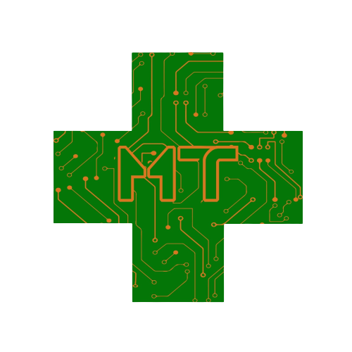

# MediTech


Proyecto para la asignatura Proyecto de Informática realizado por 5 estudiantes de la UEM.
* **Ignacio Gil Garzón** - *Desarrollo* - [IgnacioGil](https://github.com/Ignaciogg)
* **Mario Uceda Yeves** - *Desarrollo* - [MarioUceda](https://github.com/Mario-Uceda)
* **David Partal Gómez** - *Desarrollo* - [DavidPartal](https://github.com/Tecno492)
* **Ángel Mejía Recio** - *Desarrollo* - [Angelrecio](https://github.com/Angelrecio)
* **Carlos González Van Liempt** - *Desarrollo* - [CarlosGonzalez](https://github.com/Carlosglez-vanliempt)


### Instalar:
Descarga o clona el repositorio en una carpeta propia y ábrelo usando un IDE Java 8 como puede ser Eclipse.

Ejecuta este archivo para iniciar el proyecto.

```
Principal.java
```

### Funcionalidades:

En este, simularemos el funcionamiento de una clínica por consola con 5 tipos de usuario distintos, con sus respectivas funciones.

De primeras, solicitaremos el inicio de sesión del usuario (email y contraseña) y, si es correcto (coincide con un usuario de login.jsonl), 
abriremos el menú del tipo de usuario seleccionado, que puede ser Administrador, Médico, Paciente o Recepcionista.

El **Administrador** contará con las funcionalidades para:
- Dar de alta/baja usuarios (pacientes, médicos y recepcionistas)
- Modificar datos de los usuarios

El **Médico** será capaz de:
- Ver las citas que tenga pendientes
- Recetar medicamentos a un paciente, lo que quedará indicado en la cita/historial de este último
- Ver el historial completo de sus pacientes
- Realizar conclusiones de las consultas (comentarios sobre la enfermedad / problema que sufre el paciente en la cita)

El **Paciente** contará con las funcionalidades para:
- Ver sus diferentes citas
- Solicitar nuevas citas
- Cancelar citas
- Solicitar una modificación en la fecha de sus citas
- Recibir recordatorios de sus citas vía mail
- Ver los resultados de sus consultas

El **Recepcionista** será capaz de:
- Crear citas mediante un email al paciente (añadiéndola al registro de citas de ese día al médico)
- Cancelar citas a los pacientes (eliminar lo anterior)
- Modificar citas de los pacientes
- Enviar recordatorios de citas via email

